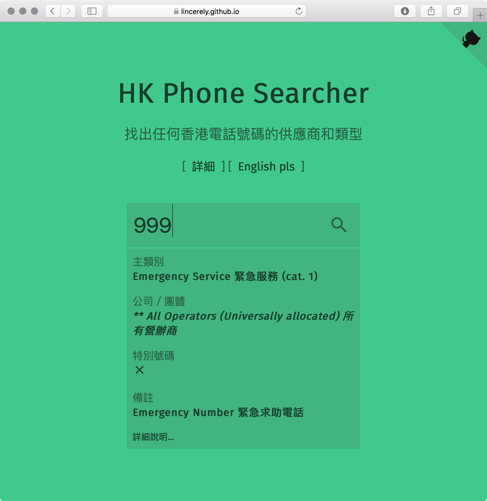

# HK Phone Searcher

Retreive HK phone number information from OFCA's number plan and provide a user-friendly interface to search through it.



The following information will be displayed on available:
 - Number Category 號碼主類別
 - NumberSub-category 號碼次類別
 - Allocated/Assigned to (Company / Entity) 用戶 (公司 / 團體)
 - Special Number 特別號碼 (✓ / ✗)
 - Remarks 備註
 
Support English and Traditional Chinese.

## Prepare Data

Get numbering plan from http://www.ofca.gov.hk/filemanager/ofca/common/datagovhk/no_plan_en_tc.xlsx and parse it into a clean json file.

``` bash
    cd data
    python3 getData.py
```    

You will need these to run above script:
 - Python3
    - Pandas
    - xlrd